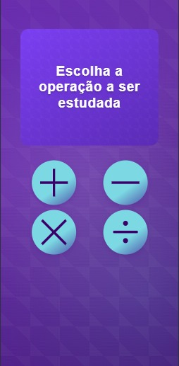

# Operações Matemáticas

Um aplicativo interativo para praticar operações matemáticas básicas (adição, subtração, multiplicação e divisão) de forma divertida e educativa.

## 📸 Screenshots

<div align="center">
  
  
  
</div>

## 🚀 Funcionalidades

- Interface intuitiva e amigável
- Quatro operações matemáticas disponíveis:
  - Adição (+)
  - Subtração (-)
  - Multiplicação (×)
  - Divisão (÷)
- Questões geradas aleatoriamente
- Feedback imediato das respostas
- Animações e efeitos visuais
- Design responsivo

## 🛠️ Tecnologias Utilizadas

- React
- Vite
- CoreUI
- CSS moderno com gradientes e efeitos visuais
- React Confetti para celebrações

## 📦 Instalação

1. Clone o repositório:
```bash
git clone https://github.com/seu-usuario/operacoes_matematicas.git
```

2. Instale as dependências:
```bash
cd operacoes_matematicas
npm install
```

3. Inicie o servidor de desenvolvimento:
```bash
npm run dev
```

## 🎯 Como Usar

1. Selecione a operação matemática que deseja praticar
2. Responda às questões geradas
3. Receba feedback imediato sobre suas respostas
4. Continue praticando com novas questões

## 🎨 Design

- Interface moderna e limpa
- Cores vibrantes e gradientes
- Animações suaves
- Feedback visual para interações
- Design responsivo para diferentes tamanhos de tela


